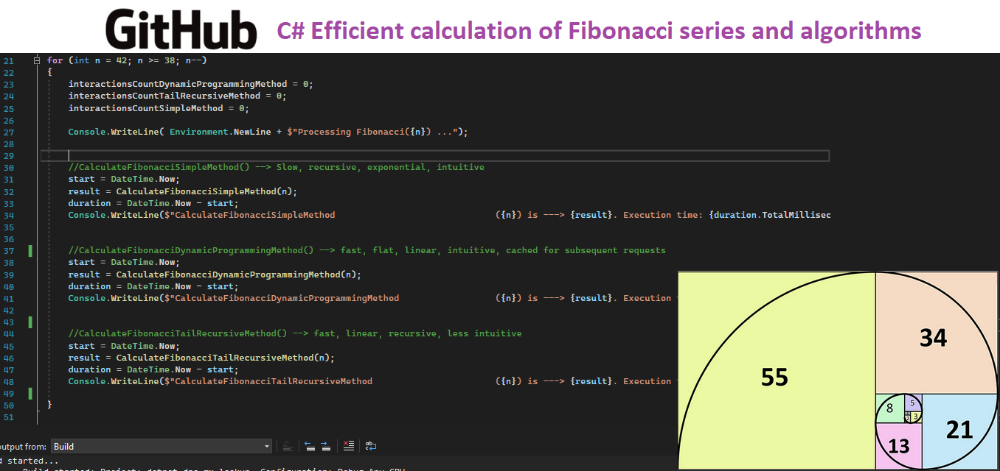
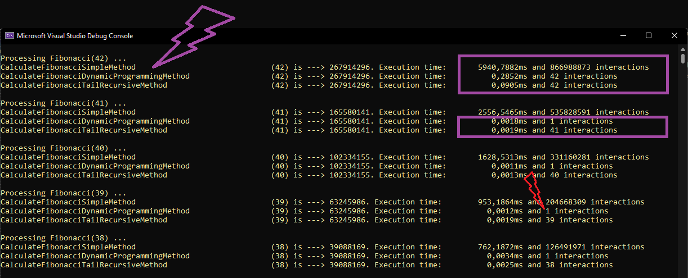
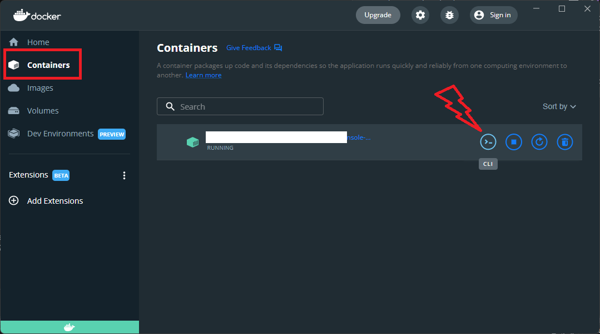

# C# Efficient calculation of Fibonacci series (algorithms performance comparison)


 
# Context

In this examples I used Fibonacci series calculation to compare 3 algorithms types:
- Recursive
- TailRecursive
- [Dynamic programming](https://en.wikipedia.org/wiki/Dynamic_programming) approach


This can be used for many proposals and algorithms. As you can see in this project, there are a huge performance difference between these algorithms.


# What does this application do?

- When this app starts, the ```Main()``` method is called automatically by dotnet.
- The app prints Fibonacci number using 3 different algorithms showing execution times and loop count for each one.
- This comparison is made for ```Fib(42)``` until ```Fib(38)``` in descending order to proove that Dynamic programming algorithm is the fastest after first call.

    

# Stack and main topics in the project
- .NET 6.0 console application
    - C# 
    - Console output
    - Simple Recursive Algorithm (the worst)
    - Flat Dynamic programming Algorithm with memoization
    - Tail Recursive Algorithm without memoization
    
- Docker
    - docker build
    - docker run
    - docker container bash interaction (from docker's host shell)


# About the Author and license
- **Erick** is a Senior Backend Developer and Architect. 
- You can reach **Erick** by email <seixaserick77@gmail.com> or Linkedin <https://www.linkedin.com/in/seixaserick/>
- Other Github Repositories: <https://github.com/seixaserick/> 
- MIT License (please check [LICENSE.txt](LICENSE.txt) for more details)


# How to run this project 

## Clone the repository

If you already installed Git for Windows, run commands below:
```
git clone https://github.com/seixaserick/dotnet-fibonacci-performance-methods
cd dotnet-fibonacci-performance-methods
```


# How to run this project in Docker containers
> If you already installed Docker Desktop, just follow these steps below


## Creating a docker image
To create a Docker image, run command line below in the command prompt of project directory:
```
docker build -t dotnet-fibonacci-performance-methods -f Dockerfile .
```


## Running the app in a docker container





To run the image in Docker container and interact with it, run command line below: 
```
docker run -it --name=dotnet-fibonacci-performance-methods --restart=unless-stopped dotnet-fibonacci-performance-methods
```

To stop the container, run command line below: 
```
docker stop dotnet-fibonacci-performance-methods
```

To remove the container (even if it is running), run command line below: 
```
docker rm --force dotnet-fibonacci-performance-methods
```


# How to build and run without Docker (Windows)

> After clone the repository you can open the project with Visual Studio. Build or just debug it pressing ```F5```.

## To compile and run it in Windows (Visual Studio required)
> Open the solution file ```dotnet-fibonacci-performance-methods.sln``` with your Visual Studio, then press ```F5``` to run the project!


# Takeaways

- The simple, recursive and intuitive Fibonacci function is the slowest way to return Fibonacci number (exponential interaction count)
- Dynamic Programming approach uses the previously calculated values to return quickly the result. 
- Dotnet apps (console or not) can run in Linux or Windows OS.
- Docker is a nice tool to run projects quickly without concern about dependencies and configurations.
- C# is very similar to other ECMA-based languages (Java, Javascript etc.)
- Console apps are simple and easy to input and output data.
- Good Markdown README.md files can help other developers to understand, clone, run and test projects.

# Homework challenge

using System.Runtime.CompilerServices;
1. Implement the ```[MethodImplAttribute(MethodImplOptions.AggressiveOptimization)]``` attribute before the function ```CalculateFibonacciSimpleMethod()``` and compare duration after rebuild. Read this article https://docs.microsoft.com/en-us/dotnet/api/system.runtime.compilerservices.methodimploptions?view=net-6.0
2. Try to implement cache in Fibonacci functions to return from cache if it was requested before. You can do it using Redis, Memcached, ```System.Runtime.Caching/MemoryCache``` or other distributed Cache solution. See [these examples](https://github.com/dotnet/AspNetCore.Docs/tree/main/aspnetcore/performance/caching/distributed/samples/6.x/DistCacheSample).
3. Replace the duration calc method for:
    ```
    Stopwatch stopWatch = new Stopwatch();
    stopWatch.Start();
    CalculateFibonacci...
    stopWatch.Stop(); 
    TimeSpan ts = stopWatch.Elapsed;
    ```
4. Inspect the Dockerfile content to see how docker pulls imagens from images's hub
5. Try to create a WebAPI and implement an endpoint to return Fibonacci calculations in a GET endpoint like ```https://my-api-server.com/api/fibonacci/41``` 

